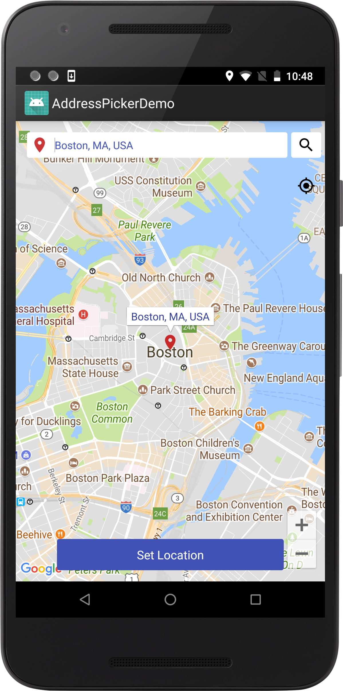
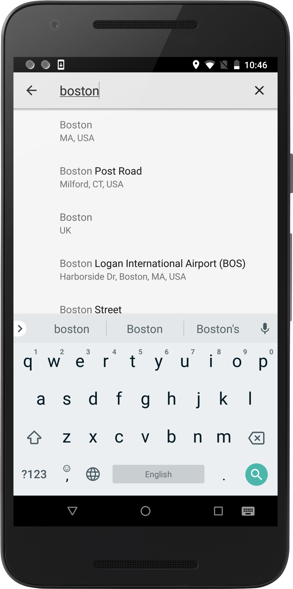
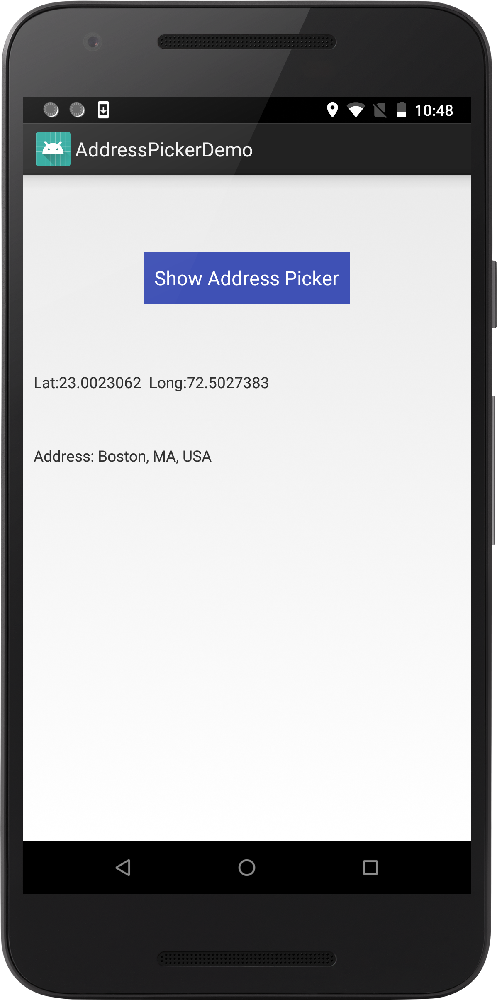

<h1>Introduction</h1>
INTUZ is presenting an interesting  Address Picker component to integrate inside your Native Android based application. 
Address Picker is a simple component, which lets you pick a location from map and search using Google Places API. 
You will get a latitude, longitude and full address for selected location.

Please follow the below steps to integrate this control in your project.

<br/><br/>
<h1>Features</h1>

- Easy & Fast to retrive location.
- You can select a location from Google Place API or User’s current location.
- Can Customize according to requirement.

<div style="float:left">



</div>


<br/><br/>
<h1>Getting Started</h1>

To use this component in your project you need to perform below steps:

1) Configure your app in  Google API Console  to get API Key and enable services.

> https://console.cloud.google.com/apis/dashboard

2) Enable below services in API Console.

```
  Google Maps Android API
  
  Google Places API for Android
  
```

3) Permission and declaration in AndroidManifest.xml file

```
    <uses-permission android:name="android.permission.INTERNET" />
    <uses-permission android:name="android.permission.ACCESS_NETWORK_STATE" />
    <uses-permission android:name="android.permission.ACCESS_COARSE_LOCATION" />
    <uses-permission android:name="android.permission.ACCESS_FINE_LOCATION" />
```

<br/>
<p><b>Note:</b> replace ‘<Your-Google-API-Key>’ with your google api key in manifeast.xml file.</p>

4) Start Address picker request by putting below code in your view :

```
                  Intent intent = new Intent(MainActivity.this, LocationPickerActivity.class);
                  startActivityForResult(intent, ADDRESS_PICKER_REQUEST);

```

5) Handle your onActivityResult for getting address, latitude and longitude as:

```
     @Override
    protected void onActivityResult(int requestCode, int resultCode, Intent data) {
        super.onActivityResult(requestCode, resultCode, data);

        if (requestCode == ADDRESS_PICKER_REQUEST) {
            try {
                if (data != null && data.getStringExtra("address") != null) {
                    String address = data.getStringExtra("address");
                    double currentLatitude = data.getDoubleExtra("lat", 0.0);
                    double currentLongitude = data.getDoubleExtra("long", 0.0);
                    txtAddress.setText("Address: "+address);
                    txtLatLong.setText("Lat:"+currentLatitude+"  Long:"+currentLongitude);

                }
            } catch (Exception ex) {
                ex.printStackTrace();
            }
        }
    }
    
```

<br/><br/>
<h1>Bugs and Feedback</h1>
For bugs, questions and discussions please use the Github Issues.

<br/><br/>
<h1>License</h1>
The MIT License (MIT)
<br/><br/>
Copyright (c) 2018 INTUZ
<br/><br/>
Permission is hereby granted, free of charge, to any person obtaining a copy of this software and associated documentation files (the "Software"), to deal in the Software without restriction, including without limitation the rights to use, copy, modify, merge, publish, distribute, sublicense, and/or sell copies of the Software, and to permit persons to whom the Software is furnished to do so, subject to the following conditions: 
<br/><br/>
THE SOFTWARE IS PROVIDED "AS IS", WITHOUT WARRANTY OF ANY KIND, EXPRESS OR IMPLIED, INCLUDING BUT NOT LIMITED TO THE WARRANTIES OF MERCHANTABILITY, FITNESS FOR A PARTICULAR PURPOSE AND NONINFRINGEMENT. IN NO EVENT SHALL THE AUTHORS OR COPYRIGHT HOLDERS BE LIABLE FOR ANY CLAIM, DAMAGES OR OTHER LIABILITY, WHETHER IN AN ACTION OF CONTRACT, TORT OR OTHERWISE, ARISING FROM, OUT OF OR IN CONNECTION WITH THE SOFTWARE OR THE USE OR OTHER DEALINGS IN THE SOFTWARE.

<br/>
<br/>
<h1></h1>
<a href="https://www.intuz.com/" target="_blank"></a>

